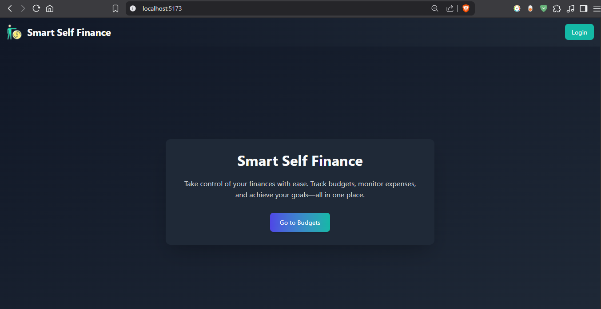
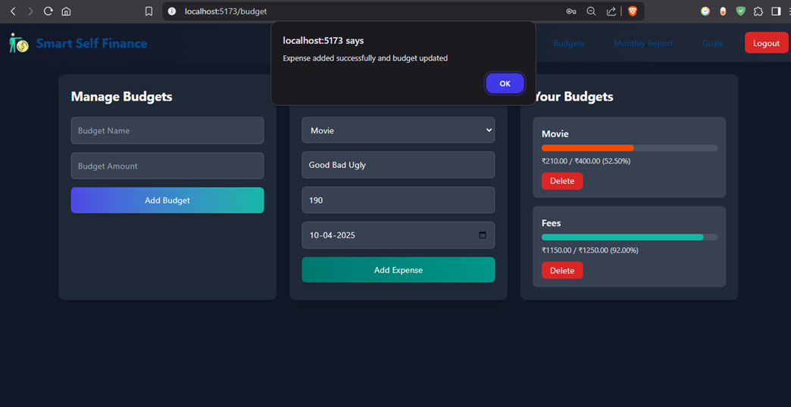
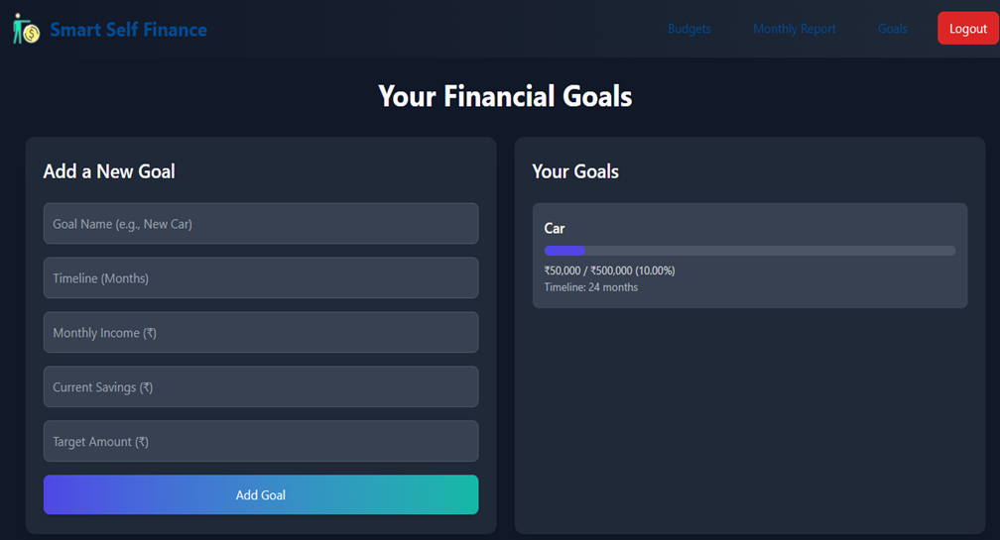
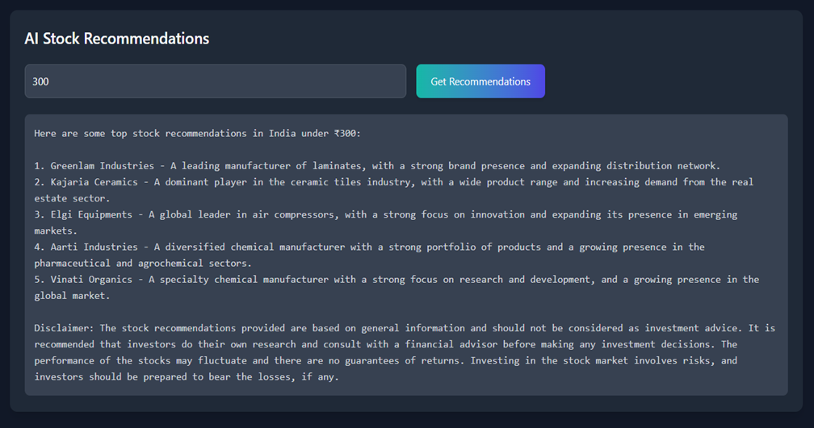

# 💸 Smart Self Finance

A responsive, AI-integrated personal finance dashboard built using **React** and **Vite**, designed for seamless budgeting, goal tracking, and monthly reporting with dark mode support.

---

## 🚀 Features

- 🔐 **Authentication** – User-friendly login and sign-up system.
- 💰 **Budgeting** – Add budgets and categorize expenses.
- 🎯 **Goal Planning** – Set financial goals and receive smart saving strategies.
- 📊 **Monthly Reports** – Visual breakdown of monthly expenses.
- 🧠 **AI Suggestions** – Smart stock tips powered by LLM via Groq.
- 🌗 **Dark Mode** – UI switches based on user/system preference.

---

## 📂 Project Structure

### 1. **Login & Registration** (`LoginSignUp.jsx`)

A modern auth form with toggling between login and sign-up modes. Uses localStorage to persist the logged-in user.


### 2. **Navbar** (`Navbar.jsx`)

Responsive navigation bar that conditionally displays links based on login state. Includes:

- Budgets
- Monthly Reports
- Goals
- Logout/Login buttons

### 3. **Budgets Page** (`budgets.jsx`)

Manage your finances easily:

- **Add Budgets**: Create a budget category with an amount.
- **Add Expenses**: Track expenses under specific budget categories.
- **Budget Progress**: View current vs original amount with a visual progress bar.
- **Delete Budget**: Remove budgets as needed.
  

### 4. **Goals Page** (`goals.jsx`)

Helps plan and track long-term financial goals:

- Input goal, timeline, savings, and income.
- Receive automatic savings plan and suggestions.
- Shows progress bars for each goal.
- Includes **AI-powered stock suggestions** based on investment amount using Groq SDK.
  

### 5. **Monthly Reports** (`Report.jsx`)

Presents expense analytics:

- Interactive **bar chart** displaying total expenses per month.
- Monthly breakdown with expense names and amounts.
- Select any month to view specific expense details.

---

## 💠 Tech Stack

- **React** (with hooks)
- **Vite** (build tool)
- **Tailwind CSS** (utility-first styling)
- **Chart.js** (visualizations)
- **Groq SDK** (AI integration)
- **Axios** (API requests)
- **React Router** (routing)
- **LocalStorage** (auth & preferences)

---

## 🧠 AI Integration

Integrated with **Groq LLaMA-3** to recommend stocks under a user-defined amount. Just input the amount and get intelligent investment tips with a disclaimer.


---

## 📟 API Endpoints

The backend endpoints used (replace with your own IP or localhost):

- `/login`
- `/register`
- `/add-budget`
- `/get-budgets`
- `/delete-budget`
- `/add-expense`
- `/get-monthly-report`
- `/get-expenses-for-month`

---

## 📦 Installation

```bash
npm install
npm run dev
```

Ensure the backend is running and accessible via the configured IP in your `.jsx` files.

---

## 🧪 Demo Credentials

```
Email: muthu@gmail.com
Password: 123
```
